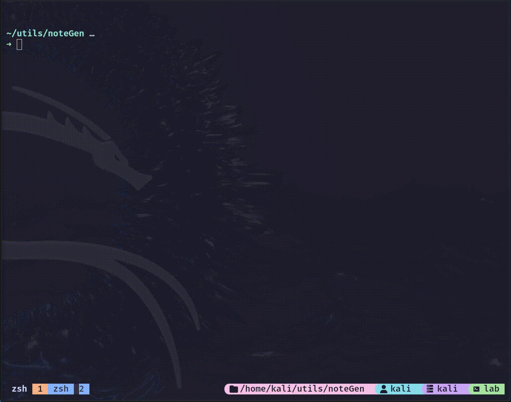

# Pentesting and Notes Template Generator

## Overview
Ngen is a Template Generator designed to facilitate the creation of notes for integrating pentesting and note-taking practices using Obsidian.

The script is meant to be a simple copy and paste from predefined templates. 
I use it to create a new folder in my template notes.

The script is based on the function [preopnote](https://github.com/0xDynamo/Prepnote/blob/main/README.md) which may be more suitable if you are looking for a fast solution. 

## Installation
Clone this repository to your local machine:

`git clone https://github.com/geekyHat/noteGen.git`

## Configuration

when you clone the script it will dowload:

- this README file
- the `ngen` script
- a folder `templates` containing 2 templates for test
- a folder `testing_directory` where you can test the script
- a file `notes_path.txt` with the template destinaton path

### Create or Modify Templates 

to create new templates you can create a new subfolder in the "templates" folder. The name of the folder will be added to the templates menu. You can populate with any file you wish. 

### Destination Directory

the first variable in the ngen script points to the file `notes_path.txt`. This files contains the directory path for the `testing-directory` directory. Once you test the script you can change the content of this files using your notes folder path. 

`echo "/home/user/myObsidianNotesPath/subdirectoryIfNeeded`

I created a folder called `machine` in my Obsidian Notes. So each time I need to work on a machine I use ngen to generate the template directly in obsidian.

## Usage

```bash
cd noteGen
# if ngen is not executable run chmod
# chmod +x ngen
./ngen <machine-name>
 
```

## Example



Contributing
Contributions are welcome! If you have any suggestions, improvements, or feature requests, feel free to open an issue or submit a pull request.

License
This project is licensed under the MIT License.


